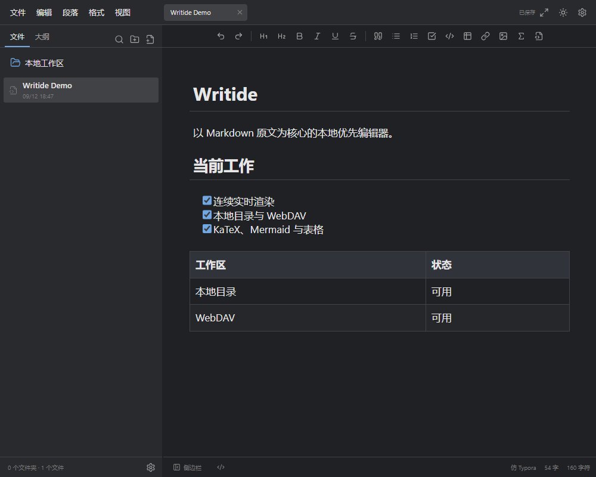
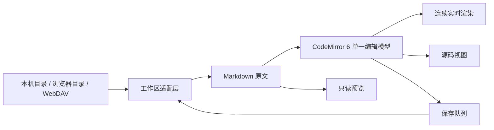

# Writide

<p align="center">
  <strong>以 Markdown 原文为唯一事实来源的本地优先 Web 编辑器</strong>
</p>

<p align="center">
  
  
  
  
  
  
</p>

Writide 是一个面向个人知识库的 Markdown 编辑器。它直接管理本地目录或自己的 WebDAV 存储，在同一份 Markdown 文本模型上提供实时渲染、源码/预览分栏和纯源码三种视图。

> 当前处于预览阶段，推荐在可信的单用户本机环境运行。Writide 不是 Typora 官方产品，也不承诺与任何编辑器完全兼容。



## 目录

- [为什么做 Writide](#为什么做-writide)
- [功能](#功能)
- [快速开始](#快速开始)
- [Docker 部署](#docker-部署)
- [使用方式](#使用方式)
- [工作原理](#工作原理)
- [项目结构](#项目结构)
- [开发](#开发)
- [数据与安全](#数据与安全)
- [当前限制](#当前限制)
- [路线图](#路线图)
- [贡献](#贡献)
- [许可证](#许可证)

## 为什么做 Writide

许多在线 Markdown 编辑器擅长预览，却不擅长长期管理真实文件；富文本编辑器操作顺滑，却可能在保存时重写原始 Markdown。Writide 的选择是：

- Markdown 原文始终是唯一可写数据模型。
- 渲染结果是投影，不从预览 DOM 反向拼回 Markdown。
- 本地文件夹、浏览器授权目录和 WebDAV 使用同一套工作区语义。
- 保存失败、远端冲突和权限丢失必须显式反馈，不静默覆盖或改存别处。

## 功能

### 编辑体验

- 仿 Typora 的连续实时渲染视图
- 源码/预览分栏与纯源码视图
- 单一 CodeMirror 6 编辑模型，共享选区、历史和保存状态
- 跨段拖选、全文选择、撤销/重做、查找与替换
- 标题、引用、有序列表、无序列表、任务列表及自动续写
- 加粗、斜体、删除线、下划线和链接等常用行内格式
- 代码块高亮、行号、语言标记与可选折行
- KaTeX 数学公式、Mermaid 图表和任务列表渲染
- 表格单元格直接编辑、键盘跨格与上下文菜单

### 文件与图片

- 文件树、多标签页、大纲跳转和上次工作区恢复
- 本机工作区、File System Access 授权目录、浏览器临时工作区
- 相对图片路径与 `文档名.assets/` 资源目录
- 图片预览、缩放、复制、重命名和资源管理器定位
- 目录改名/移动先复制并校验全部字节，再清理原目录
- 多图文档按阅读位置预取，并尽量保持异步加载时的滚动位置

### WebDAV

- 坚果云作为默认入口，也可连接兼容 WebDAV 的个人存储
- 可直接连接远端子目录，避免扫描无关文件
- 文件树按层、按页加载；正文仅在打开时读取
- ETag 条件保存、同名覆盖保护、写后核对与断线重连
- 图片近视口预取，默认前后各 5 张、最多 10 个调度任务
- 服务端图片磁盘缓存、自然尺寸缓存、容量管理与版本检查
- Windows使用DPAPI、Docker/Linux使用AES-256-GCM，可选加密保存密码和自动登录

## 快速开始

### 环境要求

- Node.js 22.12 或更高版本
- npm
- Chromium、Chrome 或 Edge
- Windows 10/11 可获得完整的目录与资源管理器集成

### 安装

```bash
git clone https://github.com/shiranzby/Writide.git
cd Writide
npm ci
npm start
```

浏览器打开 <http://127.0.0.1:5173/>。

Windows 用户也可以双击 `start-writide.bat`。服务就绪后会自动打开默认浏览器；保存所有文档后，可双击 `stop-writide.bat` 停止对应项目进程。

### 自定义端口

```powershell
$env:PORT = '5195'
./start-writide.bat
```

当前开发服务还会使用 `PORT + 1` 作为热更新端口。启动日志保存在 `writide.log`。

## Docker 部署

`v0.2.0` 提供 `linux/amd64` 与 `linux/arm64` 多架构镜像，覆盖常见 x86-64 电脑、NAS、服务器，以及 64 位 ARMv8/AArch64 设备。GitHub Actions 会分别构建并启动检查两个架构，再发布统一镜像；设备无需安装 Node.js，也无需本机编译。

```bash
git clone --branch v0.2.0 https://github.com/shiranzby/Writide.git
cd Writide
docker compose pull
docker compose up -d --no-build
docker compose ps
```

浏览器打开 `http://Docker设备地址:5173/`，默认账号为 `admin`，默认密码为 `password`。进入后在“设置 → 访问安全”修改为至少 8 个字符的新密码；修改结果以摘要保存在 Docker 数据卷中。需要固定域名、监听地址或初始密码时再复制 `.env.example` 为 `.env` 并修改。

默认镜像为 `ghcr.io/shiranzby/writide:0.2.0`，Docker 会自动选择当前设备架构。也可以先单独确认设备能拉取：

```bash
docker pull ghcr.io/shiranzby/writide:0.2.0
```

无法连接 GHCR 时，可从 [v0.2.0 Releases](https://github.com/shiranzby/Writide/releases/tag/v0.2.0) 下载对应架构的离线镜像；其他架构可按 Docker 指南从源码构建。

首次访问会出现浏览器账号密码窗口。完整的安装、局域网地址、架构判断、升级、备份、停止、故障排查及可直接交给 AI 的部署提示词见 [Docker 部署指南](docs/DOCKER.md)。该配置不是多用户平台或已完成安全审计的公网服务，远程访问必须放在 HTTPS/VPN 等独立安全边界之后。

## 使用方式

### 本地目录

在应用中选择一个 Markdown 文件夹。支持 File System Access API 的浏览器会直接读写所授权的目录；权限失效后需要重新授权，应用不会悄悄把修改保存到服务器副本。

图片建议使用相对路径：

```markdown

```

### 连接坚果云

1. 在坚果云创建第三方应用密码。
2. 打开 Writide 的 WebDAV 连接窗口。
3. 地址留空可使用默认地址 `https://dav.jianguoyun.com/dav/Typora/`，目录名称区分大小写。
4. 如果笔记位于子目录，可直接填写 `https://dav.jianguoyun.com/dav/Typora/`。
5. 输入账号和应用密码，按需要启用保存密码与自动登录。

坚果云对访问频率和单次目录条目数有限制。Writide 会分页、延迟正文读取、缓存图片并为保存预留请求额度，但无法知道同一账号被其他客户端消耗的额度。详见 [WebDAV 使用说明](docs/WEBDAV.md)。

## 工作原理



核心原则是单向数据流：工作区读取 Markdown，CodeMirror 产生文本事务，装饰层依据源范围绘制标题、列表、表格、代码、公式和图片，保存队列再把原文写回工作区。预览 DOM 不参与持久化。

### 前端

- **CodeMirror 6**：文本、选区、历史、键盘输入与事务
- **markdown-it**：只读预览和块级 Markdown 渲染
- **DOMPurify**：清理预览 HTML
- **KaTeX / Mermaid**：数学公式与图表
- **highlight.js**：代码高亮
- **Lucide**：界面图标
- **Vite**：开发服务和前端构建

### 本机服务

- **Node.js HTTP 服务**：静态入口、本机工作区 API 与 Vite 中间件
- **webdav**：远端协议操作
- **fast-xml-parser**：解析 WebDAV 分页目录响应
- **有界图片头解析**：读取常见 Web 图片的自然尺寸，异常格式不阻塞显示
- **凭据加密**：Windows使用DPAPI，Docker/Linux使用持久卷内AES-256-GCM凭据库

## 项目结构

```text
Writide/
├─ .github/workflows/       # GitHub Actions 可移植检查
├─ docs/                    # 开发、WebDAV、安全边界与发布说明
├─ public/                  # 不经打包转换的静态页面
├─ scripts/                 # Windows 服务管理辅助脚本
├─ server/                  # 本机工作区、WebDAV、凭据与图片缓存
├─ src/                     # 浏览器应用和编辑器实现
├─ tests/                   # Node 单元测试、Playwright 交互测试和模拟服务
├─ Workspace/               # 默认本机数据目录，不进入公共仓库
├─ server.mjs               # 应用服务入口
├─ index.html               # Vite 页面入口
├─ vite.config.js           # 前端构建配置
└─ start/stop-writide.*     # Windows 启停入口
```

浏览器代码位于 `src/`，本机服务位于 `server/`；两者通过受限的本机 HTTP 接口通信。

## 开发

```bash
npm ci
npx playwright install chromium
npm run build
```

运行不依赖私人文件和真实网盘的公开检查：

```bash
node --test \
  tests/webdav.unit.mjs \
  tests/webdav-recovery.unit.mjs \
  tests/webdav-loading.unit.mjs \
  tests/webdav-image-cache.unit.mjs \
  tests/document-rename.unit.mjs \
  tests/image-rename-handle.unit.mjs \
  tests/image-reference.unit.mjs \
  tests/live-preview-cache.unit.mjs \
  tests/directory-migration.unit.mjs

npx playwright test -c playwright.portable.config.ts --workers=1
```

公开 Playwright 测试使用隔离端口和模拟 WebDAV，不需要网盘账号。部分历史验收测试仍依赖本机路径，不属于公共 CI。

## 数据与安全

- Docker默认监听所有网卡以便局域网部署，并使用已公开的初始密码 `password`；首次登录后必须在“设置 → 访问安全”修改。
- 当前没有公网登录、多用户隔离、CSRF 防护和完整安全审计。
- 请勿把当前服务直接通过内网穿透或端口转发暴露到公网。
- WebDAV密码默认只保存在服务内存；显式保存时，Windows使用当前用户DPAPI，Docker/Linux使用AES-256-GCM加密后写入 `/data`。
- 图片缓存位于运行服务的设备，不是远端原件，也不是未保存草稿的备份。
- 发布 Issue、日志或测试轨迹前，请移除账号、路径、正文和图片等私人信息。

完整说明见 [安全策略](SECURITY.md)。

## 当前限制

- 仍是预览版本，首次处理特殊复杂 Markdown 时应先备份。
- WebDAV 文档可跨目录移动，并会先复制校验同级 `.assets` 资源；远端文件夹改名、文件夹移动、删除和完整离线同步尚未交付。
- WebDAV 保存失败后会保留当前编辑内容，但尚无独立的离线草稿与三方冲突合并界面。
- 图片文件操作与 Markdown 撤销不是跨文件原子事务。
- 从未读取过尺寸的远端图片仍需估算占位，极端文档的首次滚动几何仍可能变化。
- 浏览器临时工作区使用 `localStorage`，不适合保存大型附件。
- Docker面向可信单用户测试；支持加密保存WebDAV密码及重启后自动重连，但尚未完成多用户隔离与独立安全审计。
- 文件树暂不把所有图片作为独立文档标签打开。

当前版本为 `0.2.0` 预览版；新问题请通过脱敏后的最小复现提交。

## 路线图

- [ ] 离线草稿与远端冲突恢复
- [ ] 设备侧图片缓存和完整缓存状态面板
- [ ] 图片独立标签页与更多附件预览
- [x] 单用户 Docker 静态运行路径与 amd64/arm64 多架构镜像
- [ ] 根据真实设备需求评估更多 CPU 架构
- [ ] 公网认证、HTTPS 部署说明与安全审计
- [ ] 主入口状态与工作区提供者进一步拆分
- [ ] 将剩余私人路径测试迁移为公开合成夹具

路线图表示方向，不代表交付承诺。

## 贡献

欢迎通过 Issue 提交脱敏后的最小复现，也欢迎针对一个明确行为提交 Pull Request。修改编辑器时请保持单一 Markdown 模型，并同时验证源文本、选区/光标几何、Undo 与保存结果。

开始前请阅读 [贡献指南](CONTRIBUTING.md)。

## 许可证

本项目使用 [MIT License](LICENSE)，版权归 `shiranzby` 所有。

## 致谢

Writide 使用 CodeMirror、markdown-it、KaTeX、Mermaid、highlight.js、DOMPurify、Lucide、Vite 和 webdav 等优秀开源项目构建。Typora、MarkText、SoloMD、Tolaria 及多款在线 Markdown 编辑器为交互研究提供了参考；本项目不包含或声称复刻它们的私有源码。
